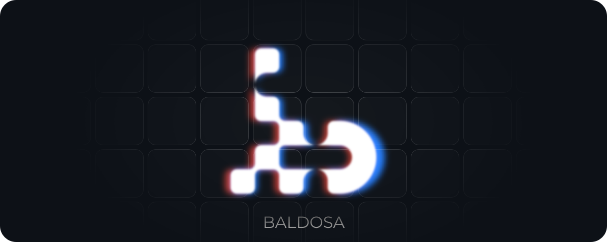

<div align="center">

</div>

<br>

Baldosa is an infinite (well, max int) grid of tiles, where tile content is submitted by users and selected through a bidding mechanism.

> [!WARNING]
> This project is under active development and quite unstable.

- [current prototype](https://loreanvictor.github.io/baldosa)
- [mock demo](https://baldosa.surge.sh)

## Development Setup

Create a `.env` at the root of the project
with the following content:

```bash
# .env
AWS_REGION=<aws-region>
S3_SUBMIT_BUCKET=<a-bucket-for-submissions>
S3_PUBLISH_BUCKET=<a-bucket-for-published-content>
```

> [!NOTE]
>
> The publish bucket (`S3_PUBLISH_BUCKET`) should be publicly accessible, readable by all, with proper CORS configuration.

Then add a `.env` file to the `publisher` directory, with the following content:

```bash
# publisher/.env
RUST_LOG=info,publisher=trace
AUTH_SIMPLE_KEY=<some-secret-key>

AWS_ACCESS_KEY_ID=<aws-access-key>
AWS_SECRET_ACCESS_KEY=<aws-secret-access-key>

DATABASE_URL=sqlite://tiles.db
```

> [!NOTE]
>
> The AWS key provided for `publisher` must be able to read from `S3_SUBMIT_BUCKET` and write to `S3_PUBLISH_BUCKET`.

Run all services and serve the web app:

```bash
chmod +x ./dev.sh
./dev.sh
```

Open browser console and enable developer mode:

```js
setDevMode(true)
```
